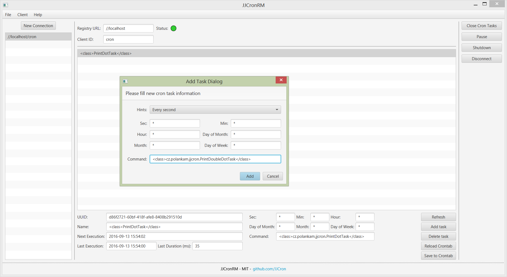

# JJCronRM - Just a Java Cron Remote Manager

**JJCronRM** is management `JavaFX` application for **[JJCron](https://github.com/JJCron/JJCron "JJCron")** instances. Connection between _UI_ and _cron_ is managed through `RMI` Java technology thus application can be used for remote management of huge number of concurent connections. Admins can use manager for listing tasks on particular instance, adding task, deleting task and permanently save all changes. Other handy features can be shutdown instance or pause all execution.

**JJCronRM** uses official `Java` dialogs which available since `Java 8u40`, be sure this version is installed before running application.

Before using **JJCronRM** please read carefully all possible information about **JJCron** cron-like Java application, big supply of this information is its [wiki](https://github.com/JJCron/JJCron/wiki) pages.

## Main features
- All code written in pure `Java` using cutting edge `Java 8` version
- Thanks to `Java` **JJCronRM** is multiplatform
- Management of instances over the network using **RMI** technology
- List all tasks from instace, delete task, add task or make your changes permanent
- Shutdown instance or simply pause all execution
- And all features of **JJCron** itself...

## Drawbacks
- Managing of multiple instances at once is not implemented (e.g. add one task to multiple instances)
- Very simple and rigorous graphical layout
- Modifying of particular task is not possible
- Whole functionality is very low-level and users have to understand how **JJCron** and crons in general works
- All drawback from **JJCron** are inherited here...

## More information
If you are interested enough read `JJCronRM` wiki pages [here](https://github.com/JJCron/JJCronRM/wiki) and start using it!

## Contribution
This project is open for contribution for anyone who want to make it better. All feasible pull requests will be merged.

## License
JJCronRM is and always will be licensed under [MIT license](LICENSE)